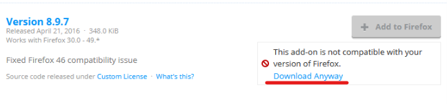

# iMacros Scripts

An open source macros scripts for most popular niches :)

## Requirements
- Mac OS or Linux or Windows
- Firefox ESR or WaterFox v55
- iMacros 8.9.7 (Add-on)


## Dependencies
Firefox 52 ESR| iMacros 8.9.7
------|------
[All Versions](https://www.mozilla.org/en-US/firefox/organizations/) | [Download](https://addons.mozilla.org/firefox/downloads/file/428670/type:attachment/imacros_for_firefox-8.9.7-fx.xpi?src=version-history)



*** Stop Auto Update for iMacros 8.9.7 because the newer version no longer supports some features.


## How to use?

1. Get the source

Clone the git repository with
```
git clone https://github.com/jinzocode/imacros-scripts.git
```

2. Copy & Paste the script you want inside ``iMacros/Macros`` folder

3. Create your own config you will find examples inside **Datasources** folder. (Each script has custom **Datasource** file or more)

4. Refresh the **SidePanel** of iMacros

5. Select the script you want then press **play**

### *** Notes

- Don't use play loop as JavaScript itself has loops.

## Why iMacros 8.9.7 not latest 9.0.3?
- Full support for window interface
- Full support for must javascript language
- Stable & Secure with good feedbacks according to imacros.net
- Latest version isn't secure and has bad feedbacks and has many bugs and not stable to work on.

##### Difference between 2 versions.
- Multi Process support the only new feature in 9.0.3
- SCREENSHOT TYPE=BROWSER is no longer possible
- SAVEAS TYPE=CPL is not available anymore
- File Upload in the TAG command cannot be supported
- No more CLICK (X/Y) commands expect existing commands
- JavaScript language is so limited as well as methods like  `imns` and `iMacros` no longer possible
- No method for `window-mediator`
- No Security Updates/No any kind of risks to  worry about


* Note: you will need to uninstall any other Firefox versions first.

##### Start strip down iMacros 8.7.9 to 9.0.3
``nsIWindowMediator`` is a method being  used to access some Features on Firefox Browser
```
var windowMediator = Components.classes["@mozilla.org/appshell/window-mediator;1"]
    .getService(Components.interfaces.nsIWindowMediator);
var window = windowMediator.getMostRecentWindow("navigator:browser");
```
We use that method to access Firefox UI or even control iMacros it self like stop or control the windows UP/DOWN/Bottom with some DOM methods to ensure the access to window content.

Example for usage 
```
window.iMacros.jsplayer2.stop();//iMacros stop button
```

Usage with DOM

```
window.document.querySelector('body').click();
```

Another Example with DOM to get element ``textContent``

```
window.document.querySelector('body').textContent;
```


these messages means you need to completely forgot ``window content`` methods.

Alternative using to click or fill forms using iMacros Basic Language

```
TAG POS=1 TYPE=A ATTR=TXT:Your<SP>Text<SP>*
```

or using ``Experimental`` Event method

```
EVENT TYPE=CLICK SELECTOR="YOUR_CSS_ELECTOR" BUTTON=0
```

In case of filling some forms

```
EVENTS TYPE=KEYPRESS SELECTOR="YOUR_CSS_ELECTOR" CHARS="Hello World!"
```

How to get CSS Selector?

* Open Developer Tools (F12)
* or Just Hit `CTRL + SHIFT + C`


###### Any Alternative for WindowsMedator?
- Unfortunately No, but I've  made some workaround for some javascript functions.

There is a function like the following being used in getting any file lines.

```javascript
function getFileLines(file_path) {
    const CRLF = "\r\n";
    const LF = "\n";
    let lines = [];
    let file_i = imns.FIO.openNode(file_path);
    let text = imns.FIO.readTextFile(file_i);
    let eol = (text.indexOf(CRLF) == -1) ? LF : CRLF;
    lines = text.split(eol);
    eol = lines.length;
    return eol;
}
```

In case of 9.0.3 its impossible to use that function
some workaround with basic iMacros Language and some javascript:

```javascript
function getFileLines(datasource_file) {
  let jsLF = "\n";
  let lines = 0;
  for (let i = 1;; i++) {
    let count = "CODE:";
    count += "SET !DATASOURCE " + datasource_file + jsLF; // your datasource file
    count += "SET !DATASOURCE_LINE " + i + jsLF;
    retcode = iimPlay(count);
    if (retcode > 0)
      lines++;
    else 
      return lines;
  }
}
```

For example `getFileLines()` takes less than millisecond and will get the numbers of any file with any size or lines in the above solution may takes some seconds or even minutes to get all rows number.

But as iMacros tool being built on `JAVA` language with  some simulators that makes this operation very slow.


If you have any functions or ideas like that just think out of the box and yo will get it with some workaround.


### Get ride of  removed commands in 9.0.3 version

Remove any Screenshots commands:

``
SCREENSHOT TYPE=(PAGE|BROWSER) FOLDER=folder_name FILE=file_name
``

Remove any SaveAs commands:

``
SAVEAS TYPE=(CPL|MHT|HTM|TXT|EXTRACT|BMP|PNG|JPEG) FOLDER=folder_name FILE=file_name
``

Remove any Upload commands:

``
TAG POS=1 TYPE=INPUT:FILE FORM=NAME:upload ATTR=NAME:uploaded_file CONTENT={file__path}
``
* You can use CLICK (X/Y) commands but you can't record it any more.

That's it

#### Some Better Ideas
The good [news](https://imacros.net/imacros-firefox-beta-coming-soon/) is there is an upcoming version for firefox quantum from iMacros developers matter of time.

Also without coding as alternative if you want the latest version just get the full iMacros version however it's not free and paid only works on Windows OS

https://imacros.net/download/

That version will be able to run all Firefox iMacros 8.7.9 scripts without issues.

So you don't have to worry about anything.

## Bugs
Please open a new [issue](https://github.com/jinzocode/imacros-scripts/issues/new)

## License
MIT: http://rem.mit-license.org

#### End User License Agreement (EULA)

1. You will not use the iMacros Scripts for **spam** or **violation** the terms of usage for any website or any other malicious activity.
2. We / You will not support anyone who is violating this EULA conditions
3. Repository is just for learning / personal purposes thus should not be part of any service available on the Internet that is trying to do any malicious activity (mass bulk request, spam etc.)

